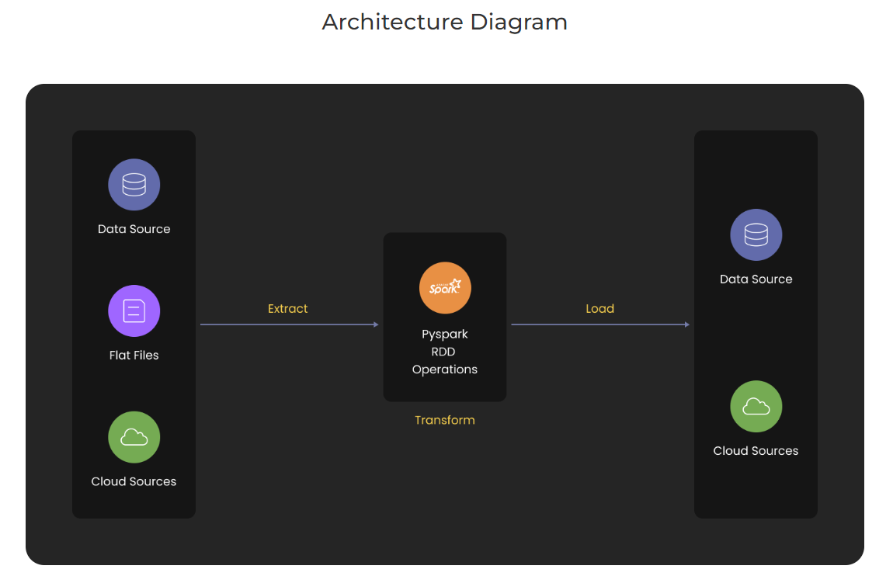

# PySpark-Project-2
PySpark Project-Build a Data Pipeline using Kafka and Redshift

## Project Description

### Overview

This project mainly focuses on the integration of PySpark with Confluent Kafka and Amazon Redshift to perform ETL(Extract-Transform-Load) and ELT(Extract-Load-Transform) operations.

## Amazon Redshift

Amazon Redshift is a fully managed petabyte-scale cloud data warehouse service. Redshift Spectrum also runs SQL queries directly against structured or unstructured data in Amazon S3 without loading them into the Redshift cluster. Redshift lets us run complex, analytic queries against structured and semi-structured data, using sophisticated query optimization, columnar storage on high-performance storage like SSD, and massively parallel query execution. It is an OLAP solution to store petabytes of information without owning Infrastructure (Paas).

 

## Confluent Kafka

Kafka is a distributed data storage designed for real-time input and processing of streaming data. Streaming data is information that is continuously generated by thousands of data sources, all of which transmit data records at the same time. A streaming platform must be able to cope with the constant influx of data and process it sequentially and progressively. Kafka efficiently stores records streams in the order in which they were created. Kafka is most commonly used to create real-time streaming data pipelines and applications that react to changing data streams. It mixes communications, storage, and stream processing to enable both historical and real-time data storage and analysis.

## Tech stack:  

➔Language: Python

➔Package: PySpark

➔Services: Docker, Confluent Kafka, Amazon Redshift

#  Spark Integration with  Redshift and Kafka
Spark can read and write data from anywhere. Integration is to process the data fastly.

    
# Extract , Transformation and Load 
To create data pipline we need ETL .

# PySpark Integration with Redshift.
Read write data from Redshift

#Note- 
- need redshift jdbc jar file
- need aws credentials : AccessKey and AccessSecretKey

# PySpark Integration with Kafka.
Data extraction using Kafka
#Requirements: AWS Cloud

- Amazon Simple Storage Service (Amazon S3, Redshift)
# Code Description
    File Name : pyspark_redshift.ipynb, pyspark_kafka.ipynb, pyspark_redshift.py and pyspark_kafka.py
    DataSets : airlines1.csv
    Jar files : redshift-jdbc42-2.0.0.4.jar
    File Description : Integration of pyspark with Redshift and Kafka.
    
#NOTE :- use findspark library when executing python script

 - import findspark
 - findspark.init()

## Steps to Run
There are two ways to execute the end to end flow.
 - Command Prompt => python script
 - spark_path spark-submit file_path
 - spark_path => <path_to_spark>>
 - file_path => <path_to_file>
 - Data file path is same as script file path

eg. <C:\Users\admin\Desktop\spark\bin>spark-submit C:\Users\admin\Desktop\Integration\pyspark_redshift.py>

- IPython

### Modular code
- Create virtualenv
- Install requirements `pip install -r requirements.txt`
- Run Code `python pyspark_redshift.py`
- Run Code `python pyspark_kafka.py`
- Check output for all the visualization
  
### Dataset Used

Data Source: [airlines1.csv](https://github.com/Raghuraj-DataEngineer/PySpark-Project-2/blob/main/airlines1.csv)

(https://github.com/Raghuraj-DataEngineer/PySpark-Project-2/blob/main/redshift-jdbc42-2.0.0.4.jar)

Here is the Data Analysis:

[pyspark_kafka.ipynb](https://github.com/Raghuraj-DataEngineer/PySpark-Project-2/blob/main/pyspark_kafka.ipynb)

[pyspark_redshift.ipynb](https://github.com/Raghuraj-DataEngineer/PySpark-Project-2/blob/main/pyspark_redshift.ipynb)

